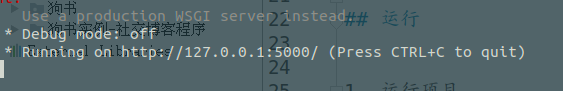

# SayHello 留言板

参考自李辉狼书例子。但是是在看完狗书之后自己写的。如有错误，请指正


## 安装

1. 克隆整个项目到本地
    ```text 
    git clone https://github.com/yatengLG/flask-learning.git
    ```
    

2. 切换到项目文件中
    ```text
    cd flask-learning/sayhello/
    ```
3. 安装依赖项
    ```text
    pip install -r requestment.txt
    ```
## 运行


1. 运行项目
    ```text
    python manage.py runserver
    ```

2. 打开本地端口5000

    具体看终端提示。
    
    
~~3. 如没有数据库，则新建数据库(默认flask-learning/sayhello/app/ 下已存在数据库 data-dev.sqlite)~~
    ```text
    python manage.py shell
    
    >> db
    
    >> db.create_all()
    
    ```
 